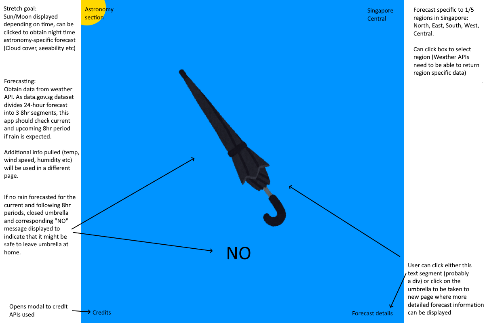
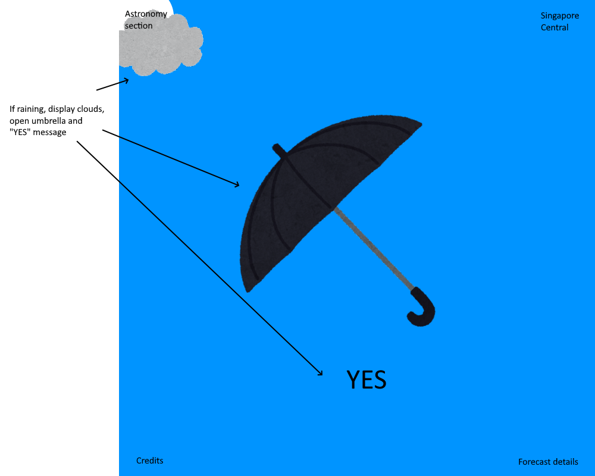
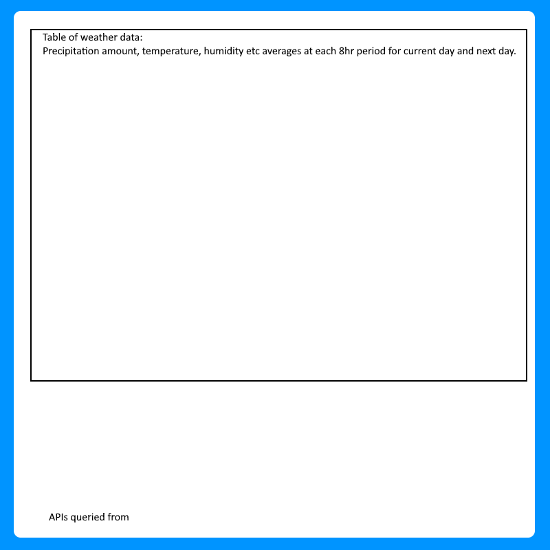

# <a href="https://umbrella-today.netlify.app/" target="_blank">Umbrella-Today</a>

## Concept

React app utilizing weather APIs to decide if user should bring out their umbrella.

App is made to be as simple to use as possible. On loading up the site, page immediately checks weather forecasts to see if an umbrella would be necessary in the 12 hours to come from time of access.

### Region specificity

App was developed primarily for use in Singapore and as such, forecasts on load are, for the most part, only relevant to Singapore.

However, app features geolocation support, which takes in the user's device's coordinates for forecasting, and can accept input of custom coordinates to check forecasts for any point on the globe!

### Additional forecast information

As obtaining all these weather data only for the user to have an extremely simplified glimpse might seem to be a waste to some users, detailed information about weather forecasts were displayed on a separate page, in which up to 3 days of weather forecasts, portioned into 3-hour segments, were made available.

### Astronomy forecast

The weather is one of the biggest threats to stargazing and as such, astronomy hobbyists are able to utilize this app to gauge how conducive the weather at night would be for their activities. Additionally, astronomy-specific weather data (atmospheric transparency, astronomical seeing etc) are also presented on a separate page of the app, forecasting weather conditions that would significantly affect astronomical observations.

## Technologies used

### React

App was built with React. App comprises of 3 pages, linked via React Router v6.10, and each page was further divided into specialized components.

### Bootstrap

Bootstrap was used primarily to position elements within textboxes.

### CSS

Where positioning with bootstrap proved complicated, CSS was used for more strictly positioned elements.

CSS was also utilized to provide animations via transitions when modals/drawers were clicked.

### 7Timer API

Weather API (CIVIL) from <a href="http://www.7timer.info/doc.php?lang=en" target="_blank">7Timer!</a> was used to generate up to 3 days' worth of weather forecasts. These data were primarily used for umbrella recommendations but were also presented in detail for users.

Astronomy API (ASTRO) from the same site was also utilized to generate astronomy-specific weather forecasts.

### Material UI

<a href="mui.com" target="_blank" >Material UI</a>, a React component library, was utilized to provide complex, pre-built components to aid in development and as practice for using externally built components.

## Approach

For this app, I started by planning the pages I would need for displaying information obtained from the 7Timer API. As the primary purpose of this app was to recommend if an umbrella should be brought along before the user left the house, I had decided that the landing page would have to query the API and make the recommendation immediately. Additional information would then be routed to other pages, a Forecast page for detailed weather forecasts and an Astronomy page for astronomy-related forecasts.

After the pages, I started work on components to construct the elements that would make up the landing page, including components to harbour links for users to click away from.

Whenever a component became too complex, I attempted, as much as possible, to split these into smaller components for better code organization and functional scoping.

While developing this app, I attempted to diversify my page elements as much as I could, making use of modals, drawers, clickable textboxes and images etc.

## Wireframes

Main page wireframe, detailing interactive elements with plans on how they would function. This wireframe shows what the main page would look like if no rain was forecast.

Alternate main page wireframe, featuring main page if rain was forecast.

Forecast/Astronomy page wireframe, a rough design to show how the field displaying data might look like.

## Challenges

In order to minimize fetching as much as possible, I had intended to prop weather data from the Main page to the Forecast page. However, as the Forecast page could not be a child component of the Main page due to routing, I had to utilize other methods to move data around. The solution came in the form of utilizing NavLink's state to store data in an object and using the useLocation hook to access this state.

Another major challenge was attempting to fetch data when it mattered. During development, a problem that frequently appeared was that data was not being fetched when needed, such as when coordinates were changed. This was solved by introducing a state to store coordinates instead of maintaining different urls with pre-defined coordinates, allowing for coordinates to be used in the Main page's useEffect's dependency array, which thus called the GET method whenever coordinates were changed.

For better viewing experience, I had attempted to fade out the dark backdrop of modals and drawers using CSS' transition and opacity properties. However, with the way my modals and drawers had been implemented, closing them would immediately dismount the components, leading to an abrupt disappearance of the backdrop. This was solved by delaying the dismounts using setTimeouts.

## Other Credits

Umbrella and cloud images by <a href="https://www.irasutoya.com/" target="_blank">Mifune Takashi, みふねたかし</a>.
